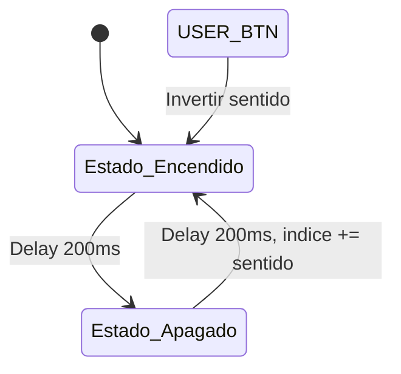

# App 1.2: Secuenciador Bidireccional

## Título y Objetivos
**App 1.2: Secuenciador de LEDs Bidireccional**

El objetivo de esta aplicación es implementar una secuencia de encendido y apagado secuencial de los LEDs onboard de la placa de desarrollo, con la capacidad de invertir el sentido de la secuencia en tiempo de ejecución mediante la interacción con el pulsador onboard. La aplicación debe ser generalista y escalable.

## Especificaciones del Circuito
* **Hardware:** LEDs LD1 (Green), LD2 (Blue), LD3 (Red) conectados a puertos GPIO.
* **Entrada:** Pulsador de usuario (USER_BTN) para invertir el sentido de la secuencia.
* **Temporización:** 200 ms de alternancia por estado.

## Teoría de Operación
El sistema utiliza una **Máquina de Estados Finitos (MEF)** bidireccional. La dirección de la secuencia se controla mediante una variable de estado denominada `sentido`, que actúa como un factor multiplicador (-1 o 1) sobre el índice del arreglo de LEDs. Cada vez que se detecta un flanco de subida en el pulsador, el sistema invierte el `sentido`, alterando el flujo de la secuencia sin detener el ciclo de parpadeo.

## Arquitectura del Software
* **Capa 1 (Hardware Mapping):** Estructura `GPIO_Config_t` con el mapeo físico de los LEDs.
* **Capa 2 (Drivers):** Funciones `HAL_GPIO_WritePin` para control de nivel lógico.
* **Capa 3 (Aplicación):** MEF con lógica bidireccional.

### Diagrama de Estados



### Detalle Capa 3 (Lógica de Inversión)

```C
indice += sentido;

if (indice >= cant_leds) {
    indice = 0;
} else if (indice < 0) {
    indice = cant_leds - 1;
}
```

## Detalles de Robustez
* **Detección de Flanco:** Implementada mediante una bandera (`btn_presionado`) para garantizar la captura de eventos única por pulsación (edge-triggering), evitando efectos de rebote.
* **Default State:** Se mantiene la estructura de seguridad que resetea el índice y apaga los LEDs ante estados indefinidos, garantizando la recuperación automática del sistema.

## Mapeo de Hardware
| LED | Puerto | Pin | Función |
| :--- | :--- | :--- | :--- |
| LD1 | GPIOB | LD1_Pin | LED Verde |
| LD2 | GPIOB | LD2_Pin | LED Azul |
| LD3 | GPIOB | LD3_Pin | LED Rojo |

## Conclusión
La aplicación demuestra cómo una arquitectura basada en capas permite añadir complejidad funcional (bidireccionalidad) con cambios mínimos en el núcleo de la lógica. La variable `sentido` permite reutilizar la misma MEF tanto para secuencias directas como inversas, optimizando el uso de recursos y facilitando el mantenimiento del software.